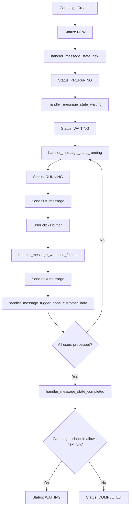
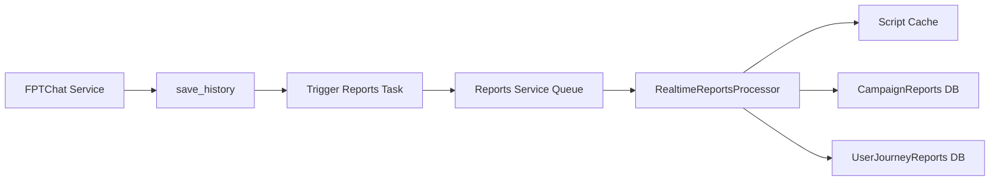
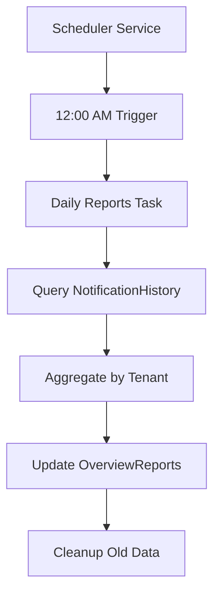

# REPORTS ENHANCEMENT DESIGN

## Tổng quan hệ thống

Hệ thống Reports hiện tại đang gặp vấn đề về performance do phải query nhiều collection (Campaign, CustomerData, NotificationHistory) mỗi khi tính toán metrics. Để giải quyết, chúng ta sẽ thiết kế 2 luồng xử lý riêng biệt:

1. **Luồng Real-time**: Cập nhật metrics ngay khi có interaction từ user
2. **Luồng Scheduled**: Tính toán tổng hợp hàng ngày vào 12h đêm

---

## Phân tích cấu trúc dữ liệu hiện tại

### 1. CampaignReports Model
```python
class CampaignReports(Document):
    campaign_id = fields.ObjectIdField(required=True)
    job_id = fields.StringField(max_length=100, allow_none=True)
    
    # Core metrics
    target_users_count = fields.IntField(default=0)      # Từ NotificationHistory (unique users)
    sent_users_count = fields.IntField(default=0)        # Từ NotificationHistory (first_message=True)
    interacted_users_count = fields.IntField(default=0)  # Từ NotificationHistory (interaction_user=True)
    interaction_rate = fields.FloatField(default=0.0)    # Calculated: interacted/sent * 100
    completion_rate = fields.FloatField(default=0.0)     # Từ script end_nodes + interactions
    
    # Node analytics
    node_analytics = fields.DictField(default=dict)      # Từ answer_target trong interactions
    funnel_data = fields.ListField(...)                  # Từ node flow analysis
    
    # Tenant isolation
    tenant_id = fields.StringField(max_length=50, required=True)
```

**Nguồn dữ liệu từ NotificationHistory:**
- `target_users_count`: Đếm unique `user_id` trong campaign
- `sent_users_count`: Đếm records có `first_message=True`
- `interacted_users_count`: Đếm unique `user_id` có `interaction_user=True`
- `node_analytics`: Phân tích từ `answer_target` và `answer_title`

### 2. OverviewReports Model
```python
class OverviewReports(Document):
    report_date = fields.AwareDateTimeField(required=True)
    report_type = fields.StringField(choices=["daily", "weekly", "monthly"])
    
    # Aggregated từ CampaignReports
    campaigns_count = fields.IntField(default=0)
    total_target_users = fields.IntField(default=0)
    total_sent_users = fields.IntField(default=0)
    total_interactions = fields.IntField(default=0)
    avg_interaction_rate = fields.FloatField(default=0.0)
    
    tenant_id = fields.StringField(max_length=50, required=True)
```

### 3. UserJourneyReports Model
```python
class UserJourneyReports(Document):
    campaign_id = fields.ObjectIdField(required=True)
    job_id = fields.StringField(max_length=100, required=True)
    user_id = fields.StringField(max_length=100, required=True)
    
    # Journey từ NotificationHistory
    journey_path = fields.ListField(fields.EmbeddedField(JourneyStep))
    completed = fields.BooleanField(default=False)
    completion_time = fields.FloatField(allow_none=True)
    
    tenant_id = fields.StringField(max_length=50, required=True)
```

---

## Phân tích luồng FPTChat Services

### Campaign Status và Task Handlers



### Điểm can thiệp cho Real-time Updates

#### 1. **save_history() - Điểm chính**
```python
# File: src/core_service/fptchat/utils/save_message_to_db.py
async def save_history(
    campaign_id: str,
    job_id: str,
    user_id: str,
    payload: dict,
    tenant_id: str,
    selected_action: str = None,
    first_message: bool = False,
    warning_message: bool = False,
):
    # Lưu NotificationHistory như hiện tại
    result = await NotificationHistory.collection.update_one(query, data, upsert=True)
    
    # 🎯 CAN THIỆP: Real-time update reports
    if result.upserted_id or result.modified_count > 0:
        await trigger_realtime_reports_update(
            campaign_id=campaign_id,
            job_id=job_id,
            user_id=user_id,
            tenant_id=tenant_id,
            event_type="message_sent" if first_message else "user_interaction",
            payload=payload,
            selected_action=selected_action
        )
```

#### 2. **InteractionHistoryManager.update_user_selection()**
```python
# File: src/core_service/fptchat/utils/interaction_history.py
async def update_user_selection(
    user_id: str,
    campaign_id: str,
    job_id: str,
    selected_action: str,
    question: str,
    target_node: str
) -> bool:
    # Update interaction như hiện tại
    result = await NotificationHistory.collection.update_one(...)
    
    # 🎯 CAN THIỆP: Update interaction metrics
    if result.modified_count > 0:
        await trigger_interaction_update(
            campaign_id=campaign_id,
            user_id=user_id,
            job_id=job_id,
            target_node=target_node,
            selected_action=selected_action
        )
```

#### 3. **handler_message_state_completed() - Campaign completion**
```python
# File: src/core_service/fptchat/tasks/handler_message/handler_message_state_completed.py
if not is_allow_next_run:
    await CampaignManagementModel.core_update_status_by_campaign_id(
        status=CampaignStatus.COMPLETED.value
    )
    
    # 🎯 CAN THIỆP: Finalize campaign reports
    await trigger_campaign_finalization(
        campaign_id=campaign_id,
        tenant_id=campaign_info.tenant_id
    )
```

---

## LUỒNG 1: REAL-TIME REPORTS UPDATE

### Kiến trúc tổng quan



### Chi tiết implementation

#### 1. **Trigger System - Non-blocking approach**

```python
# File: src/core_service/fptchat/utils/reports_trigger.py
from src.shared.trigger_task.trigger_task import trigger_task

async def trigger_realtime_reports_update(
    campaign_id: str,
    job_id: str,
    user_id: str,
    tenant_id: str,
    event_type: str,
    payload: dict = None,
    selected_action: str = None
):
    """
    Trigger reports update task - NON-BLOCKING
    Sử dụng queue để không block FPTChat service
    """
    try:
        # Gửi task tới Reports Service queue
        await trigger_task.send_task_to_reports(
            campaign_id=campaign_id,
            job_id=job_id,
            task_name="process_realtime_reports_update",
            **{
                "user_id": user_id,
                "tenant_id": tenant_id,
                "event_type": event_type,
                "payload": payload,
                "selected_action": selected_action,
                "timestamp": time.time()
            }
        )
        logger.debug(f"Triggered reports update for campaign {campaign_id}")
    except Exception as e:
        # Log error nhưng không raise để không block FPTChat
        logger.error(f"Failed to trigger reports update: {e}")
```

#### 2. **Script Cache System**

```python
# File: src/core_service/reports/utils/script_cache.py
import time
from typing import Dict, Optional
from src.core_service.core.models.campaign_model import CampaignManagementModel

class ScriptCache:
    """
    In-memory cache cho script content
    TTL: 1 hour, auto-refresh khi cần
    """
    _cache: Dict[str, Dict] = {}
    _cache_ttl = 3600  # 1 hour
    
    @classmethod
    async def get_script_info(cls, campaign_id: str) -> Optional[Dict]:
        """
        Lấy script info từ cache hoặc DB
        """
        cache_key = f"script_{campaign_id}"
        current_time = time.time()
        
        # Check cache
        if cache_key in cls._cache:
            cached_data = cls._cache[cache_key]
            if current_time - cached_data["cached_at"] < cls._cache_ttl:
                return cached_data["data"]
        
        # Cache miss hoặc expired - query DB
        try:
            campaign = await CampaignManagementModel.core_get_campaign_by_id(
                convert_mongo_object_id(campaign_id)
            )
            
            if not campaign:
                return None
            
            # Extract script info
            script_content = campaign.script_content
            script_data = {
                "nodes": cls._extract_nodes_details(script_content),
                "end_nodes": cls._identify_end_nodes(script_content),
                "flow_sequence": cls._extract_flow_sequence(script_content),
                "tenant_id": campaign.tenant_id
            }
            
            # Cache it
            cls._cache[cache_key] = {
                "data": script_data,
                "cached_at": current_time
            }
            
            return script_data
            
        except Exception as e:
            logger.error(f"Error caching script for campaign {campaign_id}: {e}")
            return None
    
    @classmethod
    def _extract_nodes_details(cls, script_content) -> Dict:
        """Extract node details từ script content"""
        nodes_details = {}
        if hasattr(script_content, 'nodes'):
            for node in script_content.nodes:
                node_id = node.get("id")
                if node_id:
                    nodes_details[node_id] = {
                        "type": node.get("type", ""),
                        "data": node.get("data", {}),
                        "script_type": node.get("data", {}).get("script_type", "")
                    }
        return nodes_details
    
    @classmethod
    def _identify_end_nodes(cls, script_content) -> List[str]:
        """Identify end nodes từ script"""
        end_nodes = []
        edges = getattr(script_content, 'edges', [])
        
        # Nodes không có outgoing edges = end nodes
        all_sources = {edge.get("source") for edge in edges}
        all_targets = {edge.get("target") for edge in edges}
        
        end_nodes = list(all_targets - all_sources)
        
        # Thêm các node có tên chứa "end"
        nodes = getattr(script_content, 'nodes', [])
        for node in nodes:
            node_id = node.get("id", "")
            if "end" in node_id.lower() and node_id not in end_nodes:
                end_nodes.append(node_id)
        
        return end_nodes
    
    @classmethod
    def invalidate_campaign(cls, campaign_id: str):
        """Invalidate cache khi campaign update"""
        cache_key = f"script_{campaign_id}"
        cls._cache.pop(cache_key, None)
```

#### 3. **Realtime Reports Processor**

```python
# File: src/core_service/reports/tasks/process_realtime_reports.py
from ..broker import reports_broker
from ..utils.script_cache import ScriptCache
from ..models.campaign_reports import CampaignReports
from ..models.user_journey_reports import UserJourneyReports

@reports_broker.task(name="process_realtime_reports_update")
async def process_realtime_reports_update(
    campaign_id: str,
    job_id: str,
    user_id: str,
    tenant_id: str,
    event_type: str,
    payload: dict = None,
    selected_action: str = None,
    timestamp: float = None
) -> dict:
    """
    Process real-time reports update
    Chỉ update incremental, không recalculate toàn bộ
    """
    try:
        logger.info(f"Processing realtime update: {event_type} for campaign {campaign_id}")
        
        # 1. Get hoặc create campaign report
        campaign_obj_id = convert_mongo_object_id(campaign_id)
        report = await CampaignReports.get_campaign_summary(
            campaign_id=campaign_obj_id,
            tenant_id=tenant_id,
            job_id=job_id
        )
        
        if not report:
            # Initialize new report với cached script
            script_info = await ScriptCache.get_script_info(campaign_id)
            report = await _initialize_campaign_report(
                campaign_id, tenant_id, job_id, script_info
            )
        
        # 2. Update metrics based on event type
        if event_type == "message_sent":
            await _update_sent_metrics(report, user_id)
            
        elif event_type == "user_interaction":
            await _update_interaction_metrics(
                report, user_id, selected_action, payload, timestamp
            )
            
            # Update user journey
            await _update_user_journey(
                campaign_id, job_id, user_id, tenant_id, 
                selected_action, payload, timestamp
            )
        
        # 3. Save updated report
        await report.commit()
        
        logger.info(f"Successfully updated realtime reports for campaign {campaign_id}")
        return {"status": "success", "campaign_id": campaign_id}
        
    except Exception as e:
        logger.error(f"Error in realtime reports update: {e}")
        return {"status": "error", "error": str(e)}

async def _update_sent_metrics(report: CampaignReports, user_id: str):
    """Update metrics khi có message được gửi"""
    # Increment sent users count (nếu chưa count user này)
    if user_id not in getattr(report, '_sent_users_cache', set()):
        report.sent_users_count += 1
        report.target_users_count = max(report.target_users_count, report.sent_users_count)
        
        # Cache để tránh duplicate count
        if not hasattr(report, '_sent_users_cache'):
            report._sent_users_cache = set()
        report._sent_users_cache.add(user_id)

async def _update_interaction_metrics(
    report: CampaignReports, 
    user_id: str, 
    selected_action: str, 
    payload: dict,
    timestamp: float
):
    """Update metrics khi có user interaction"""
    # Increment interacted users count (nếu chưa count user này)
    if user_id not in getattr(report, '_interacted_users_cache', set()):
        report.interacted_users_count += 1
        
        # Cache để tránh duplicate count
        if not hasattr(report, '_interacted_users_cache'):
            report._interacted_users_cache = set()
        report._interacted_users_cache.add(user_id)
    
    # Update interaction rate
    if report.sent_users_count > 0:
        report.interaction_rate = (report.interacted_users_count / report.sent_users_count) * 100
    
    # Update node analytics
    target_node = payload.get("answer_target") if payload else None
    if target_node and selected_action:
        await _update_node_analytics(report, target_node, selected_action, user_id)

async def _update_node_analytics(
    report: CampaignReports, 
    target_node: str, 
    selected_action: str, 
    user_id: str
):
    """Update node analytics incrementally"""
    if not report.node_analytics:
        report.node_analytics = {}
    
    if target_node not in report.node_analytics:
        report.node_analytics[target_node] = {
            "reached_count": 0,
            "choices": {},
            "users_reached": set()
        }
    
    node_data = report.node_analytics[target_node]
    
    # Update reached count (nếu user chưa reach node này)
    if user_id not in node_data.get("users_reached", set()):
        node_data["reached_count"] += 1
        node_data["users_reached"].add(user_id)
    
    # Update choice count
    if selected_action not in node_data["choices"]:
        node_data["choices"][selected_action] = 0
    node_data["choices"][selected_action] += 1

async def _update_user_journey(
    campaign_id: str,
    job_id: str, 
    user_id: str,
    tenant_id: str,
    selected_action: str,
    payload: dict,
    timestamp: float
):
    """Update user journey reports"""
    try:
        # Get hoặc create user journey
        journey = await UserJourneyReports.get_user_journey(
            campaign_id=convert_mongo_object_id(campaign_id),
            job_id=job_id,
            user_id=user_id,
            tenant_id=tenant_id
        )
        
        if not journey:
            journey = UserJourneyReports(
                campaign_id=convert_mongo_object_id(campaign_id),
                job_id=job_id,
                user_id=user_id,
                tenant_id=tenant_id,
                journey_path=[],
                total_interactions=0
            )
        
        # Add new step to journey
        target_node = payload.get("answer_target") if payload else "unknown"
        new_step = {
            "node_id": target_node,
            "timestamp": datetime.fromtimestamp(timestamp),
            "action": "interacted",
            "choice": selected_action
        }
        
        journey.journey_path.append(new_step)
        journey.total_interactions += 1
        
        # Check completion
        script_info = await ScriptCache.get_script_info(campaign_id)
        end_nodes = script_info.get("end_nodes", []) if script_info else []
        
        if target_node in end_nodes:
            journey.completed = True
            journey.exit_node = target_node
            
            # Calculate completion time
            if journey.journey_path:
                start_time = journey.journey_path[0]["timestamp"]
                end_time = journey.journey_path[-1]["timestamp"]
                journey.completion_time = (end_time - start_time).total_seconds()
        
        await journey.commit()
        
    except Exception as e:
        logger.error(f"Error updating user journey: {e}")
```

#### 4. **Integration với FPTChat Services**

```python
# File: src/core_service/fptchat/utils/save_message_to_db.py (Modified)
from .reports_trigger import trigger_realtime_reports_update

async def save_history(
    campaign_id: str,
    job_id: str,
    user_id: str,
    payload: dict,
    tenant_id: str,
    selected_action: str = None,
    first_message: bool = False,
    warning_message: bool = False,
):
    # Existing code...
    result = await NotificationHistory.collection.update_one(query, data, upsert=True)
    
    # 🎯 NEW: Trigger realtime reports update
    if result.upserted_id or result.modified_count > 0:
        await trigger_realtime_reports_update(
            campaign_id=campaign_id,
            job_id=job_id,
            user_id=user_id,
            tenant_id=tenant_id,
            event_type="message_sent" if first_message else "user_interaction",
            payload=payload,
            selected_action=selected_action
        )
    
    logger.info(f"NotificationHistory - Inserted: {result.upserted_id is not None}")
```

```python
# File: src/core_service/fptchat/utils/interaction_history.py (Modified)
from .reports_trigger import trigger_interaction_update

class InteractionHistoryManager:
    @staticmethod
    async def update_user_selection(
        user_id: str,
        campaign_id: str,
        job_id: str,
        selected_action: str,
        question: str,
        target_node: str
    ) -> bool:
        # Existing code...
        result = await NotificationHistory.collection.update_one(...)
        
        # 🎯 NEW: Trigger interaction update
        if result.modified_count > 0:
            await trigger_interaction_update(
                campaign_id=campaign_id,
                user_id=user_id,
                job_id=job_id,
                target_node=target_node,
                selected_action=selected_action
            )
        
        return result.modified_count > 0
```

### Performance và Scalability

#### **Ưu điểm của Real-time approach:**

1. **Non-blocking**: FPTChat service không bị chậm
2. **Incremental updates**: Chỉ update delta, không recalculate toàn bộ
3. **Cache efficiency**: Script content được cache, giảm 80% DB queries
4. **Real-time insights**: Metrics available ngay lập tức
5. **Horizontal scaling**: Mỗi campaign có thể process parallel

#### **Resource Management:**

```python
# File: src/core_service/reports/utils/resource_manager.py
class ResourceManager:
    """
    Quản lý tài nguyên cho big data system
    """
    
    @staticmethod
    async def should_process_realtime(campaign_id: str) -> bool:
        """
        Quyết định có nên process realtime hay không
        Dựa trên load hiện tại và priority
        """
        # Check Redis queue depth
        queue_depth = await redis_client.llen(f"reports_queue_{campaign_id}")
        
        # Nếu queue quá sâu, skip để tránh overload
        if queue_depth > 1000:
            logger.warning(f"Queue depth too high for {campaign_id}, skipping realtime")
            return False
        
        return True
    
    @staticmethod
    async def batch_process_if_needed(campaign_id: str):
        """
        Nếu có quá nhiều pending updates, chuyển sang batch mode
        """
        pending_count = await redis_client.llen(f"reports_queue_{campaign_id}")
        
        if pending_count > 500:
            # Trigger batch processing
            await trigger_task.send_task_to_reports(
                campaign_id=campaign_id,
                task_name="process_batch_reports_update",
                batch_size=pending_count
            )
```

---

## LUỒNG 2: SCHEDULED DAILY REPORTS

### Kiến trúc tổng quan



### Chi tiết implementation

#### 1. **Daily Scheduler**

```python
# File: src/schedule_service/tasks/daily_reports.py
from src.core_service.reports.tasks.process_overview_reports import process_daily_overview_reports

@schedule_broker.task(name="trigger_daily_reports")
async def trigger_daily_reports():
    """
    Trigger hàng ngày lúc 12h đêm
    Process overview reports cho tất cả tenants
    """
    try:
        logger.info("Starting daily reports processing")
        
        # Get all active tenants
        active_tenants = await Tenant.get_active_tenants()
        
        for tenant in active_tenants:
            # Trigger daily overview cho từng tenant
            await process_daily_overview_reports.kiq(
                tenant_id=tenant.tenant_id,
                report_date=datetime.now().date()
            )
            
            # Delay nhỏ để tránh overload
            await asyncio.sleep(1)
        
        logger.info(f"Triggered daily reports for {len(active_tenants)} tenants")
        
    except Exception as e:
        logger.error(f"Error triggering daily reports: {e}")
```

#### 2. **Daily Overview Processor**

```python
# File: src/core_service/reports/tasks/process_overview_reports.py (Enhanced)
@reports_broker.task(name="process_daily_overview_reports")
async def process_daily_overview_reports(
    tenant_id: str,
    report_date: date
) -> dict:
    """
    Process daily overview reports từ NotificationHistory
    Query trực tiếp từ DB để đảm bảo accuracy
    """
    try:
        logger.info(f"Processing daily overview for tenant {tenant_id}, date {report_date}")
        
        start_date = datetime.combine(report_date, datetime.min.time())
        end_date = start_date + timedelta(days=1)
        
        # 1. Query NotificationHistory trong ngày
        daily_notifications = await _query_daily_notifications(
            tenant_id, start_date, end_date
        )
        
        # 2. Aggregate metrics
        metrics = await _calculate_daily_metrics(daily_notifications)
        
        # 3. Upsert OverviewReports
        await OverviewReports.upsert_overview_report(
            tenant_id=tenant_id,
            report_type="daily",
            report_date=start_date,
            metrics=metrics
        )
        
        logger.info(f"Completed daily overview for tenant {tenant_id}")
        return {"status": "success", "tenant_id": tenant_id, "metrics": metrics}
        
    except Exception as e:
        logger.error(f"Error processing daily overview: {e}")
        return {"status": "error", "error": str(e)}

async def _query_daily_notifications(
    tenant_id: str, 
    start_date: datetime, 
    end_date: datetime
) -> List[dict]:
    """
    Query NotificationHistory cho ngày cụ thể
    """
    query = {
        "tenant_id": tenant_id,
        "created_at": {"$gte": start_date, "$lt": end_date}
    }
    
    notifications = []
    async for notification in NotificationHistory.find(query):
        notifications.append({
            "campaign_id": notification.campaign_id,
            "job_id": notification.job_id,
            "user_id": notification.user_id,
            "first_message": getattr(notification, 'first_message', False),
            "interaction_user": getattr(notification, 'interaction_user', False),
            "answer_target": getattr(notification, 'answer_target', ''),
            "timestamp": getattr(notification, 'timestamp', 0)
        })
    
    return notifications

async def _calculate_daily_metrics(notifications: List[dict]) -> dict:
    """
    Tính toán metrics từ notifications
    """
    # Group by campaign
    campaigns_data = {}
    
    for notif in notifications:
        campaign_id = str(notif["campaign_id"])
        if campaign_id not in campaigns_data:
            campaigns_data[campaign_id] = {
                "sent_users": set(),
                "interacted_users": set(),
                "total_interactions": 0
            }
        
        campaign_data = campaigns_data[campaign_id]
        
        # Count sent users (first_message)
        if notif["first_message"]:
            campaign_data["sent_users"].add(notif["user_id"])
        
        # Count interacted users
        if notif["interaction_user"]:
            campaign_data["interacted_users"].add(notif["user_id"])
            campaign_data["total_interactions"] += 1
    
    # Aggregate across campaigns
    total_campaigns = len(campaigns_data)
    total_sent = sum(len(data["sent_users"]) for data in campaigns_data.values())
    total_interactions = sum(data["total_interactions"] for data in campaigns_data.values())
    total_interacted = sum(len(data["interacted_users"]) for data in campaigns_data.values())
    
    avg_interaction_rate = (total_interacted / total_sent * 100) if total_sent > 0 else 0.0
    
    return {
        "campaigns_count": total_campaigns,
        "total_target_users": total_sent,  # Approximation
        "total_sent_users": total_sent,
        "total_interactions": total_interactions,
        "avg_interaction_rate": avg_interaction_rate,
        "campaigns_completed": 0,  # TODO: Calculate from campaign status
        "campaigns_running": 0,
        "campaigns_error": 0
    }
```

---

## Tổng kết và Deployment

### **Deployment Steps:**

1. **Phase 1**: Implement Script Cache và Realtime Processor
2. **Phase 2**: Integrate với FPTChat services (non-breaking)
3. **Phase 3**: Deploy Daily Scheduler
4. **Phase 4**: Monitor và optimize

### **Monitoring và Alerting:**

```python
# File: src/core_service/reports/utils/monitoring.py
class ReportsMonitoring:
    @staticmethod
    async def check_realtime_health():
        """Monitor realtime processing health"""
        # Check queue depths
        # Check processing times
        # Alert if issues detected
        pass
    
    @staticmethod
    async def check_daily_reports_completion():
        """Verify daily reports completed successfully"""
        # Check all tenants processed
        # Verify data consistency
        pass
```

### **Performance Expectations:**

- **Real-time updates**: < 100ms per interaction
- **Daily processing**: < 30 minutes cho 1M notifications
- **Memory usage**: < 500MB cho script cache
- **Queue throughput**: > 10K messages/second

Hệ thống này sẽ scale tốt với hàng triệu users và cung cấp insights real-time cho business decisions. 
