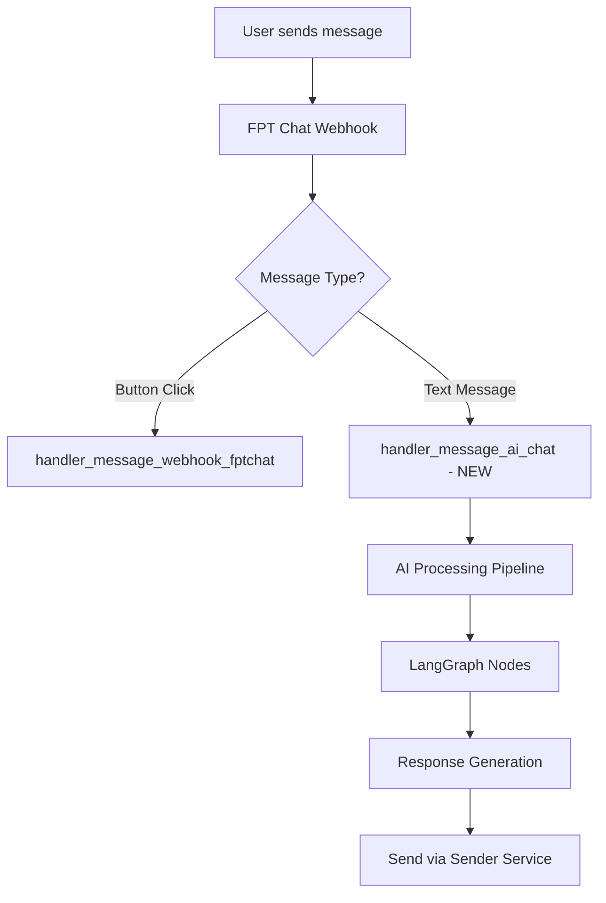
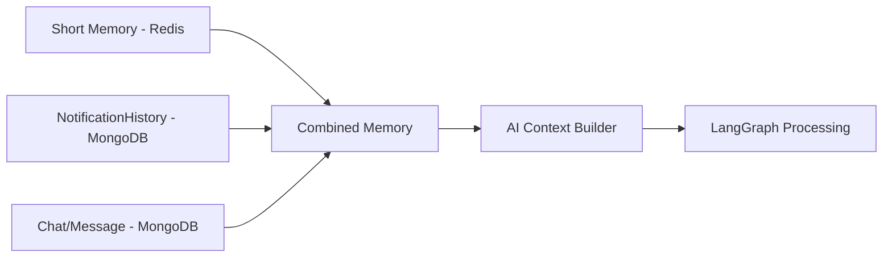

# 🤖 AI CHATBOT INTEGRATION - PHÂN TÍCH & KẾ HOẠCH TRIỂN KHAI

## 📋 TỔNG QUAN VẤN ĐỀ

### 🎯 **MỤC TIÊU CHÍNH**
Triển khai tính năng AI chatbot sử dụng Gemini LLM để:
1. **Admin/Super Admin**: Query campaigns và dữ liệu hệ thống qua function calling
2. **End Users**: Trò chuyện về campaigns đã nhận, hỏi về FTEL/SCC qua RAG
3. **Memory Management**: Long-term & short-term memory với notification integration
4. **Vector Database**: Qdrant integration cho RAG capabilities

### 🔍 **PHÂN TÍCH HIỆN TRẠNG**

#### **✅ CÓ SẴN:**
- Webhook infrastructure đã hoàn chỉnh (`handler_webhook_fptchat`)
- Notification system với `NotificationHistory` 
- TaskIQ queue system (FPTChat ↔ Sender services)
- Basic LangChain implementation (`ai_chatbot.py`)
- Memory management structure (`memory_manager.py`)
- System prompts (`system_prompt.py`)

#### **❌ CẦN PHÁT TRIỂN:**
- AI message webhook handler (khác với button click)
- Memory integration với notification system
- Function calling cho admin queries
- RAG với Qdrant vector database
- LangGraph workflow cho complex scenarios

## 🛠️ **KIẾN TRÚC ĐỀ XUẤT**

### **📡 WEBHOOK FLOW**



### **🧠 MEMORY ARCHITECTURE**



## 🎯 **LANGGRAPH vs LANGCHAIN QUYẾT ĐỊNH**

### **✅ CHỌN LANGGRAPH VÌ:**

1. **Complex Routing Logic:**
   - Admin queries → Function calling node
   - User questions → RAG retrieval node  
   - Campaign questions → Memory/notification node
   - General chat → Simple LLM node

2. **State Management:**
   - Track user context (admin vs user)
   - Maintain conversation flow
   - Handle memory across multiple turns

3. **Conditional Flows:**
   - Different paths for different user types
   - Dynamic tool selection based on query
   - Error handling và fallback strategies

4. **Scalability:**
   - Easy to add new nodes (image analysis, file upload, etc.)
   - Better debugging và monitoring
   - Parallel processing capabilities

### **🏗️ LANGGRAPH NODE STRUCTURE**

```python
class AIWorkflow:
    def __init__(self):
        self.workflow = StateGraph(AIState)
        
    # Nodes:
    - classifier_node          # Phân loại intent
    - admin_function_node      # Function calling cho admin
    - rag_retrieval_node       # Tìm kiếm Qdrant
    - campaign_memory_node     # Xử lý notification memory
    - general_chat_node        # Chat thường
    - response_builder_node    # Build final response
```

## 📊 **USE CASES & WORKFLOWS**

### **1. 🔧 ADMIN/SUPER ADMIN QUERIES**

**Kịch bản:** Admin hỏi "Cho tôi danh sách campaigns của tenant XYZ"

**Flow:**
```
Input → Classifier → Admin Function Node → Database Query → Response Builder
```

**Implementation:**
```python
@tool
async def get_campaigns_by_tenant(tenant_id: str) -> List[Dict]:
    """Get campaigns for specific tenant"""
    # Query campaign_management collection
    
@tool  
async def get_campaign_statistics(campaign_id: str) -> Dict:
    """Get campaign performance stats"""
    # Query notification_history aggregations
```

### **2. 👤 USER CAMPAIGN QUESTIONS**

**Kịch bản:** User hỏi "Cho tôi xem lại thông báo về khuyến mãi"

**Flow:**
```
Input → Classifier → Campaign Memory Node → NotificationHistory Query → Response Builder
```

**Memory Integration:**
```python
async def get_user_campaign_context(user_id: str) -> Dict:
    # Combine:
    # 1. NotificationHistory (campaigns user received)
    # 2. Short-term memory (recent conversation)
    # 3. Chat history (previous AI interactions)
```

### **3. 🔍 RAG KNOWLEDGE QUERIES**

**Kịch bản:** User hỏi "FTEL có những dịch vụ gì?"

**Flow:**
```
Input → Classifier → RAG Retrieval Node → Qdrant Search → Context Builder → LLM → Response Builder
```

**Qdrant Integration:**
```python
from qdrant_client import QdrantClient

async def search_knowledge_base(query: str) -> List[Dict]:
    # Vector search in Qdrant
    # Return relevant documents về FTEL/SCC
```

## 🔧 **TECHNICAL IMPLEMENTATION**

### **📁 FILE STRUCTURE**

```
src/core_service/fptchat/
├── ai/
│   ├── __init__.py
│   ├── workflow.py           # Main LangGraph workflow
│   ├── nodes/
│   │   ├── __init__.py
│   │   ├── classifier.py     # Intent classification
│   │   ├── admin_functions.py# Function calling tools
│   │   ├── rag_retrieval.py  # Qdrant integration
│   │   ├── campaign_memory.py# Notification integration
│   │   └── response_builder.py
│   ├── tools/
│   │   ├── __init__.py
│   │   ├── campaign_tools.py # Admin database tools
│   │   └── rag_tools.py      # Vector search tools
│   └── state.py              # LangGraph state definition
├── tasks/handler_message/
│   └── handler_message_ai_chat.py  # NEW: AI chat webhook handler
├── utils/
│   ├── memory_manager.py     # ENHANCED: Integrate notifications
│   └── ai_context_builder.py# NEW: Build context from multiple sources
```

### **🔄 WEBHOOK DETECTION LOGIC**

```python
# In send_message_util.py
async def handler_webhook_fptchat(input_request: dict) -> None:
    entry_message = input_request.get("entry", [{}])[0].get("messaging", [{}])[0]
    
    # Check message type
    if "postback" in entry_message:
        # Button click → existing handler
        await trigger_existing_button_handler(...)
    elif "message" in entry_message:
        # Text message → AI chat handler
        await trigger_ai_chat_handler(entry_message)
```

### **💾 ENHANCED MEMORY MANAGER**

```python
class EnhancedMemoryManager:
    async def get_ai_context(self, user_id: str, user_type: str = "user") -> Dict:
        """Build complete context for AI processing"""
        
        context = {
            "short_term": await self.get_short_term_memory(user_id),
            "notifications": await self.get_user_notifications(user_id),
            "chat_history": await self.get_chat_history(user_id),
            "user_profile": await self.get_user_profile(user_id),
            "user_type": user_type  # "admin", "super_admin", "user"
        }
        
        return context
        
    async def get_user_notifications(self, user_id: str) -> List[Dict]:
        """Get user's campaign notifications from NotificationHistory"""
        # Query NotificationHistory cho user_id
        # Return campaign content, timestamps, interactions
```

### **🎯 LANGGRAPH WORKFLOW**

```python
from langgraph.graph import StateGraph, START, END
from langgraph.graph.message import AnyMessage

class AIState(TypedDict):
    messages: Annotated[List[AnyMessage], add_messages]
    user_id: str
    user_type: str
    context: Dict[str, Any]
    intent: str
    rag_results: Optional[List[Dict]]
    function_results: Optional[Dict]

class AIWorkflow:
    def __init__(self):
        self.workflow = StateGraph(AIState)
        self._build_graph()
    
    def _build_graph(self):
        # Add nodes
        self.workflow.add_node("classifier", self.classify_intent)
        self.workflow.add_node("admin_functions", self.handle_admin_query)
        self.workflow.add_node("rag_retrieval", self.search_knowledge)
        self.workflow.add_node("campaign_memory", self.get_campaign_context)
        self.workflow.add_node("general_chat", self.general_conversation)
        self.workflow.add_node("response_builder", self.build_response)
        
        # Add edges with conditions
        self.workflow.add_edge(START, "classifier")
        self.workflow.add_conditional_edges(
            "classifier",
            self.route_based_on_intent,
            {
                "admin_query": "admin_functions",
                "rag_query": "rag_retrieval", 
                "campaign_query": "campaign_memory",
                "general": "general_chat"
            }
        )
        # All paths lead to response builder
        for node in ["admin_functions", "rag_retrieval", "campaign_memory", "general_chat"]:
            self.workflow.add_edge(node, "response_builder")
        
        self.workflow.add_edge("response_builder", END)
```

## 📋 **IMPLEMENTATION ROADMAP**

### **🚀 PHASE 1: CORE INFRASTRUCTURE (Week 1-2)**

1. **Setup LangGraph Environment**
   ```bash
   pip install langgraph langchain-google-genai qdrant-client
   ```

2. **Create AI Webhook Handler**
   - `handler_message_ai_chat.py`
   - Webhook detection logic
   - Basic message routing

3. **Enhanced Memory Manager**
   - Integrate NotificationHistory
   - Build AI context from multiple sources
   - Redis caching cho performance

### **🧠 PHASE 2: LANGGRAPH WORKFLOW (Week 2-3)**

1. **Basic Workflow Structure**
   - State definition
   - Core nodes (classifier, response_builder)
   - Simple routing logic

2. **Intent Classification**
   - Prompt engineering cho classification
   - Admin vs User detection
   - Query type identification

3. **General Chat Node**
   - Basic LLM interaction
   - Context-aware responses

### **🔧 PHASE 3: FUNCTION CALLING (Week 3-4)**

1. **Admin Tools Development**
   ```python
   @tool
   async def get_campaigns(tenant_id: str = None) -> List[Dict]
   
   @tool  
   async def get_campaign_stats(campaign_id: str) -> Dict
   
   @tool
   async def search_users(query: str) -> List[Dict]
   ```

2. **Permission System**
   - Verify admin/super_admin permissions
   - Tenant isolation
   - Audit logging

### **📚 PHASE 4: RAG INTEGRATION (Week 4-5)**

1. **Qdrant Setup**
   ```python
   from qdrant_client import QdrantClient
   
   class QdrantRAG:
       def __init__(self):
           self.client = QdrantClient(host="localhost", port=6333)
       
       async def search(self, query: str, collection: str = "ftel_knowledge"):
           # Vector search implementation
   ```

2. **Knowledge Base Integration**
   - FTEL service information
   - SCC center data
   - FAQ và documentation

### **💾 PHASE 5: CAMPAIGN MEMORY (Week 5-6)**

1. **Notification Integration**
   ```python
   async def get_user_campaign_memory(user_id: str) -> Dict:
       # Get notifications from NotificationHistory
       # Build campaign conversation context
       # Include user interactions và selections
   ```

2. **Context Building**
   - Campaign content integration
   - User interaction history
   - Personalized responses

### **🧪 PHASE 6: TESTING & OPTIMIZATION (Week 6-7)**

1. **Unit Tests**
   - Individual node testing
   - Memory manager tests
   - Function calling validation

2. **Integration Tests**
   - End-to-end workflow
   - Webhook processing
   - Error handling

3. **Performance Optimization**
   - Caching strategies
   - Query optimization
   - Response time monitoring

## ⚠️ **LƯU Ý QUAN TRỌNG**

### **🔒 SECURITY CONSIDERATIONS**

1. **Admin Permission Validation**
   ```python
   async def validate_admin_permissions(user_id: str, requested_action: str) -> bool:
       # Check user role và tenant permissions
       # Log all admin queries for audit
   ```

2. **Data Isolation**
   - Tenant-based data filtering
   - User-specific notification access
   - Secure function calling

### **📊 MONITORING & LOGGING**

1. **AI Interaction Tracking**
   ```python
   async def log_ai_interaction(
       user_id: str, 
       query: str, 
       response: str,
       intent: str,
       processing_time: float
   ):
       # Store in separate AI interaction log
   ```

2. **Performance Metrics**
   - Response times per node
   - Memory usage patterns
   - Error rates by intent type

### **🔄 ERROR HANDLING**

1. **Graceful Degradation**
   ```python
   async def fallback_response(error: Exception, context: Dict) -> str:
       # Return helpful error message
       # Log error for debugging
       # Suggest alternative actions
   ```

2. **Rate Limiting**
   - Per-user query limits
   - Admin function call throttling
   - Resource protection

## 🎯 **SUCCESS METRICS**

### **📈 KPIs TO TRACK**

1. **Functionality Metrics**
   - Intent classification accuracy (>90%)
   - Admin query success rate (>95%)
   - RAG retrieval relevance (>85%)
   - Response time (<3 seconds)

2. **User Experience**
   - User engagement rate
   - Conversation completion rate
   - User satisfaction scores

3. **System Performance**
   - Memory usage efficiency
   - Cache hit rates
   - Error recovery rates

## 🚀 **NEXT STEPS**

1. **Immediate Actions:**
   - Review và approve architecture
   - Setup development environment
   - Create basic project structure

2. **Decision Points:**
   - Confirm Qdrant integration approach
   - Finalize admin function specifications
   - Define user permission model

3. **Risk Mitigation:**
   - Backup plans for LangGraph complexity
   - Performance testing strategy
   - Security review process

---

**💡 TỔNG KẾT:** 
Approach này sử dụng LangGraph để xây dựng một AI chatbot powerful và scalable, tích hợp seamlessly với notification system hiện tại, đồng thời cung cấp khả năng function calling cho admin và RAG cho knowledge queries. Architecture đảm bảo maintainability, security, và performance cho long-term success.
