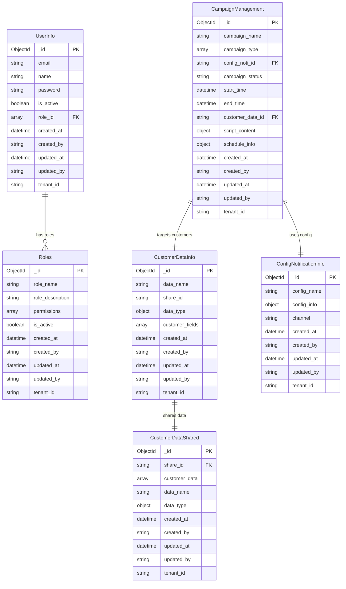
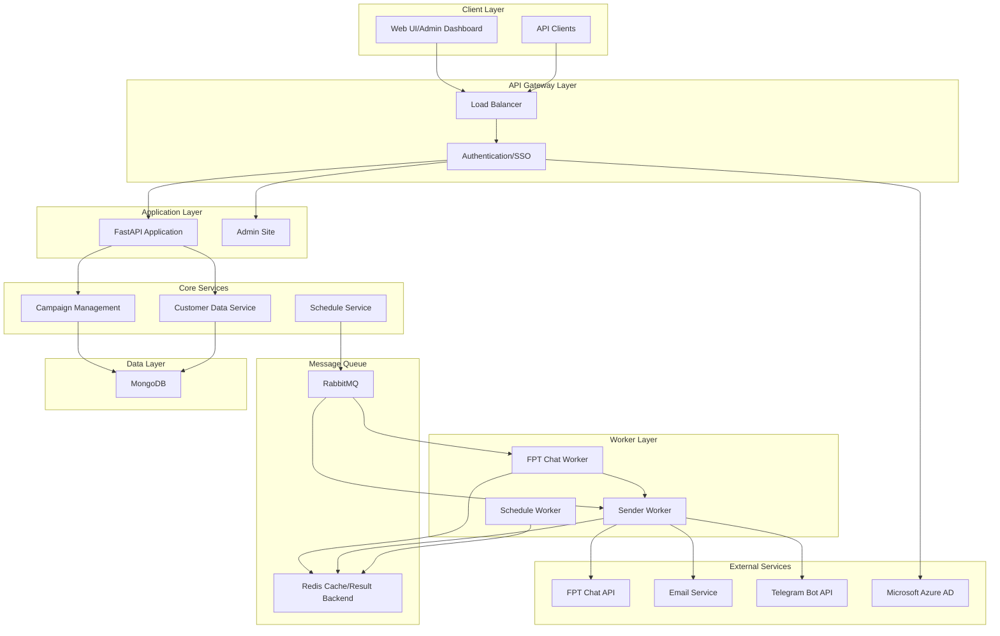
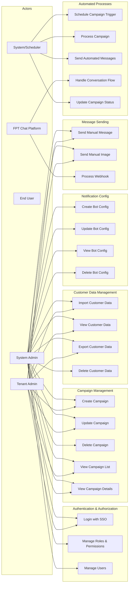
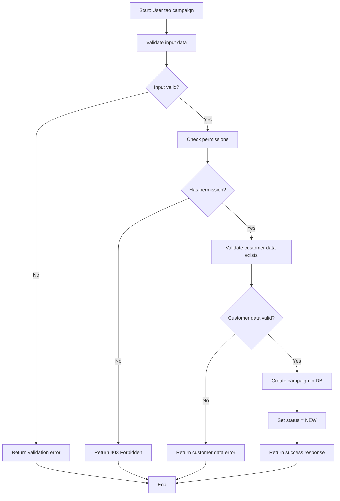
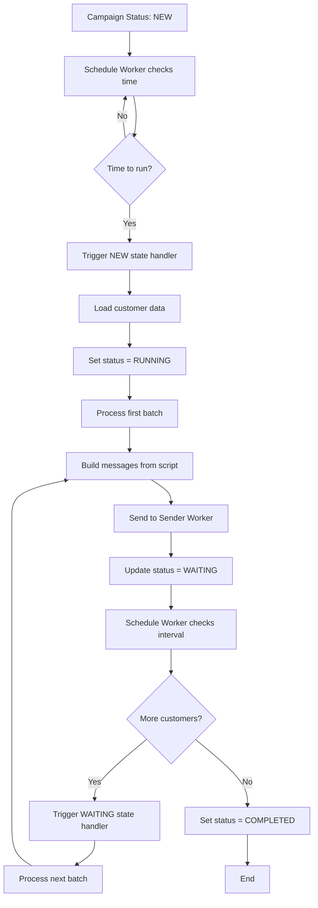
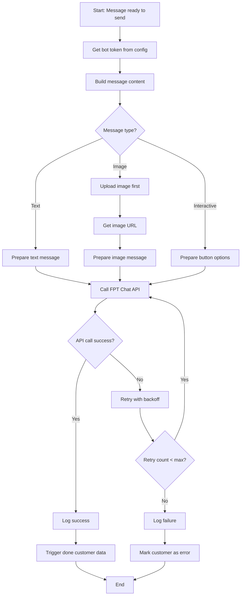
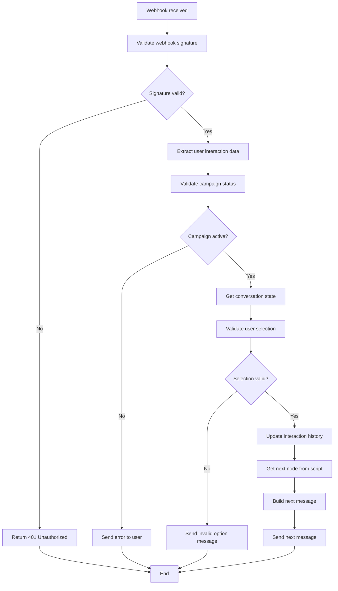
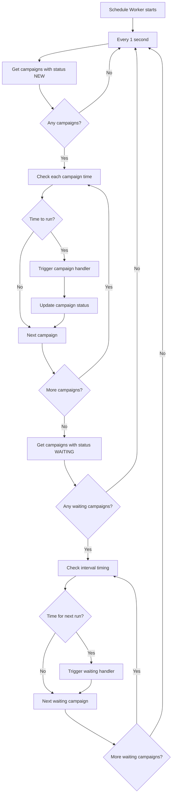
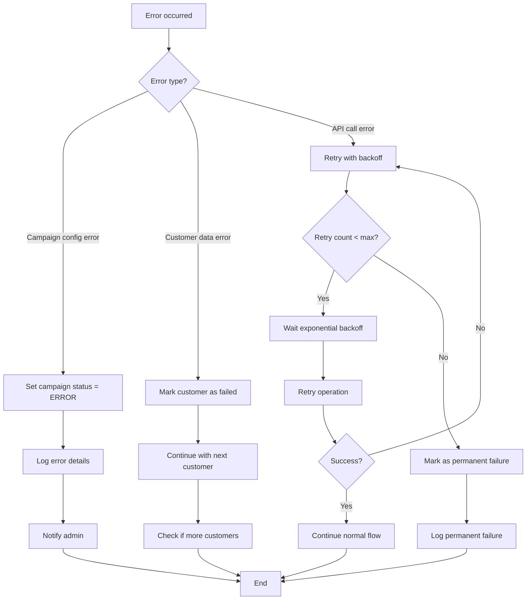

# SRS - SCC NOTIFICATION BOT
## Tài liệu Đặc tả Yêu cầu Phần mềm (Software Requirements Specification)

---

## MỤC LỤC

### A. GIỚI THIỆU
I. [Mục đích tài liệu](#i-mục-đích-tài-liệu)  
II. [Thông tin chung](#ii-thông-tin-chung)  
III. [Tài liệu tham khảo](#iii-tài-liệu-tham-khảo)  
IV. [Thuật ngữ, từ ngữ viết tắt](#iv-thuật-ngữ-từ-ngữ-viết-tắt)  

### B. [ERD (Entity Relationship Diagram)](#b-erd-entity-relationship-diagram)

### C. TỔNG QUAN
I. [Sơ đồ tổng quan](#i-sơ-đồ-tổng-quan)  
II. [Use-case diagram](#ii-use-case-diagram)  
III. [Danh sách các chức năng và Phân quyền](#iii-danh-sách-các-chức-năng-và-phân-quyền)  
IV. [Các yêu cầu phi chức năng](#iv-các-yêu-cầu-phi-chức-năng)  

### D. [ĐẶC TẢ CÁC CHỨC NĂNG](#d-đặc-tả-các-chức-năng)

---

## A. GIỚI THIỆU

### I. Mục đích tài liệu
Tài liệu này mô tả các yêu cầu chức năng và phi chức năng của hệ thống **SCC Notification Bot** - một hệ thống quản lý và gửi thông báo tự động đa kênh (FPT Chat, Email, Telegram). Tài liệu này được xây dựng để:

- Cung cấp cái nhìn tổng quan về hệ thống cho các bên liên quan
- Định nghĩa rõ ràng các chức năng và luồng xử lý
- Làm cơ sở cho việc kiểm thử bảo mật (penetration testing)
- Hỗ trợ việc phát triển và bảo trì hệ thống

### II. Thông tin chung

**Tên dự án:** SCC Notification Bot  
**Phiên bản:** 1.0  
**Ngày tạo:** [Ngày hiện tại]  
**Người tạo:** Development Team  

**Mô tả hệ thống:**
SCC Notification Bot là một hệ thống notification automation được thiết kế theo kiến trúc microservices với các worker xử lý bất đồng bộ. Hệ thống hỗ trợ:

- Quản lý campaign marketing tự động
- Gửi tin nhắn đa kênh (FPT Chat, Email, Telegram)
- Xử lý luồng conversation tương tác
- Lập lịch và trigger campaign theo thời gian
- Quản lý dữ liệu khách hàng và phân quyền

**Công nghệ sử dụng:**
- **Backend:** FastAPI, Python 3.8+
- **Database:** MongoDB (Motor driver)
- **Cache:** Redis
- **Message Queue:** RabbitMQ với TaskIQ
- **Authentication:** Microsoft Azure AD SSO + JWT
- **Deployment:** Docker, Gunicorn

### III. Tài liệu tham khảo
- [README copy.md](./zmarkdown/README%20copy.md)
- [summary.md](./zmarkdown/summary.md)
- FastAPI Documentation
- TaskIQ Documentation
- MongoDB Documentation

### IV. Thuật ngữ, từ ngữ viết tắt

| Thuật ngữ | Định nghĩa |
|-----------|------------|
| **Campaign** | Chiến dịch gửi tin nhắn có kèm lịch trình và script content |
| **Script Content** | Nội dung tin nhắn và luồng conversation (nodes/edges) |
| **Customer Data** | Dữ liệu khách hàng được import để gửi tin nhắn |
| **TaskIQ** | Distributed task queue system thay thế Celery |
| **Worker** | Process xử lý task bất đồng bộ |
| **Tenant** | Đơn vị tổ chức có dữ liệu riêng biệt (multi-tenancy) |
| **FPT Chat** | Nền tảng chat của FPT để gửi tin nhắn |
| **SSO** | Single Sign-On với Microsoft Azure AD |

---

## B. ERD (Entity Relationship Diagram)

---

## C. TỔNG QUAN

### I. Sơ đồ tổng quan

### II. Use-case diagram

### III. Danh sách các chức năng và Phân quyền

#### 3.1 Modules và Permissions

| Module | Actions | Description |
|--------|---------|-------------|
| **USER** | VIEW, EDIT, DELETE | Quản lý thông tin user |
| **ROLE_PERMISSION** | VIEW, EDIT, CREATE, DELETE | Quản lý role và permission |
| **CUSTOMER_DATA** | VIEW, EDIT, CREATE, DELETE, EXPORT | Quản lý dữ liệu khách hàng |
| **CAMPAIGN** | VIEW, EDIT, CREATE, DELETE | Quản lý campaign |
| **NOTIFICATION** | VIEW, EDIT, CREATE, DELETE, SEND | Quản lý cấu hình thông báo |
| **REPORT** | VIEW, EXPORT | Xem báo cáo |
| **CONFIG** | VIEW, EDIT, CREATE, DELETE | Quản lý cấu hình hệ thống |
| **TENANT** | VIEW, EDIT, CREATE, DELETE | Quản lý tenant (Super Admin only) |

#### 3.2 Roles mặc định

| Role | Permissions | Description |
|------|-------------|-------------|
| **Super Admin** | `__all__` | Quyền truy cập toàn bộ hệ thống |
| **Admin** | `__all__` | Quyền admin trong tenant |
| **Guest** | `user:view`, `user:edit` | Quyền hạn chế |

### IV. Các yêu cầu phi chức năng

#### 4.1 Performance Requirements
- **Response Time:** API response < 2 seconds
- **Throughput:** Hỗ trợ 1000+ concurrent users
- **Message Processing:** 10,000+ messages/minute

#### 4.2 Security Requirements
- **Authentication:** SSO với Microsoft Azure AD
- **Authorization:** Role-based access control (RBAC)
- **Data Protection:** Encryption in transit và at rest
- **Input Validation:** Pydantic schema validation

#### 4.3 Reliability Requirements
- **Availability:** 99.9% uptime
- **Data Consistency:** ACID transactions với MongoDB
- **Error Handling:** Comprehensive error logging và recovery

#### 4.4 Scalability Requirements
- **Horizontal Scaling:** Stateless workers
- **Load Balancing:** Support multiple API instances
- **Database Scaling:** MongoDB sharding support

---

## D. ĐẶC TẢ CÁC CHỨC NĂNG

### 1. Campaign Management

#### 1.1 Create Campaign (UC4)

**Business Rules (BR):**
- BR-001: Campaign name phải unique trong tenant
- BR-002: Start time phải < End time
- BR-003: Customer data phải tồn tại và thuộc cùng tenant
- BR-004: Script content phải có ít nhất 1 node start

**Technical Requirements (TR):**
- TR-001: API endpoint: `POST /v1/campaign/create_campaign`
- TR-002: Permission required: `campaign:create`
- TR-003: Input validation bằng Pydantic schema
- TR-004: Auto-generate campaign ID (ObjectId)

**Activity Diagram:**

#### 1.2 Campaign Processing Workflow

**Activity Diagram - Campaign Lifecycle:**

### 2. Message Sending Flow

#### 2.1 Send Message to FPT Chat

**Activity Diagram:**

### 3. Webhook Processing

#### 3.1 Handle FPT Chat Webhook

**Business Rules:**
- BR-005: Webhook phải có valid signature
- BR-006: User interaction phải trong thời gian campaign active
- BR-007: Answer phải match với available options

**Activity Diagram:**

### 4. Schedule System

#### 4.1 Campaign Scheduling

**Technical Requirements:**
- TR-005: Schedule worker chạy mỗi 1 giây
- TR-006: Hỗ trợ 2 loại schedule: AT_TIME và INTERVAL
- TR-007: Timezone mặc định: Asia/Bangkok

**Activity Diagram:**

### 5. Error Handling và Recovery

#### 5.1 Campaign Error Recovery

**Business Rules:**
- BR-008: Lỗi campaign phải được log và notify admin
- BR-009: Customer data lỗi không ảnh hưởng campaign khác
- BR-010: Retry mechanism với exponential backoff

**Activity Diagram:**

---

## Ghi chú cho việc triển khai

### Sơ đồ Mermaid có thể render
Các sơ đồ trên sử dụng Mermaid syntax và có thể được render trong:
- GitHub/GitLab markdown
- VS Code với Mermaid extension
- Online tools như mermaid.live
- Documentation platforms như GitBook, Notion

### Khuyến nghị phát triển tiếp
1. **Sequence Diagrams:** Thêm sequence diagrams cho API interactions
2. **State Diagrams:** Mô tả chi tiết state transitions của Campaign
3. **Component Diagrams:** Detailed architecture components
4. **Security Analysis:** Threat modeling và security requirements chi tiết
5. **Performance Testing:** Load testing scenarios và benchmarks

### Công cụ hỗ trợ vẽ sơ đồ
- **Mermaid:** Embedded trong markdown
- **Draw.io/Diagrams.net:** Export sang nhiều format
- **PlantUML:** Text-based diagrams
- **Lucidchart:** Professional diagramming tool 
